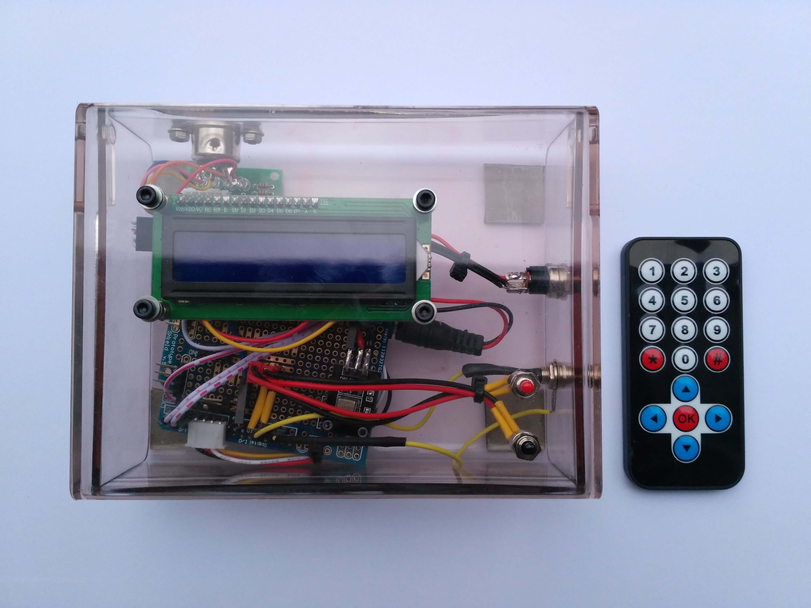

# Microstackshot
Microscope knob control powered by arduino designed for micro-stackshot photography

### DOCS
https://docs.google.com/document/d/1P0xk68gPNNNN-_sJicLlXlUDtDGnBVffxkr5Wj0we30/edit#

### Parts
 - Arduino Leonardo
 - Arduino shield
 - IR remote and receiver
 - Stepper motor with gear reduction 28YBJ-48 and driver
 - LCD screen with I2C interface
 

### Exemple

